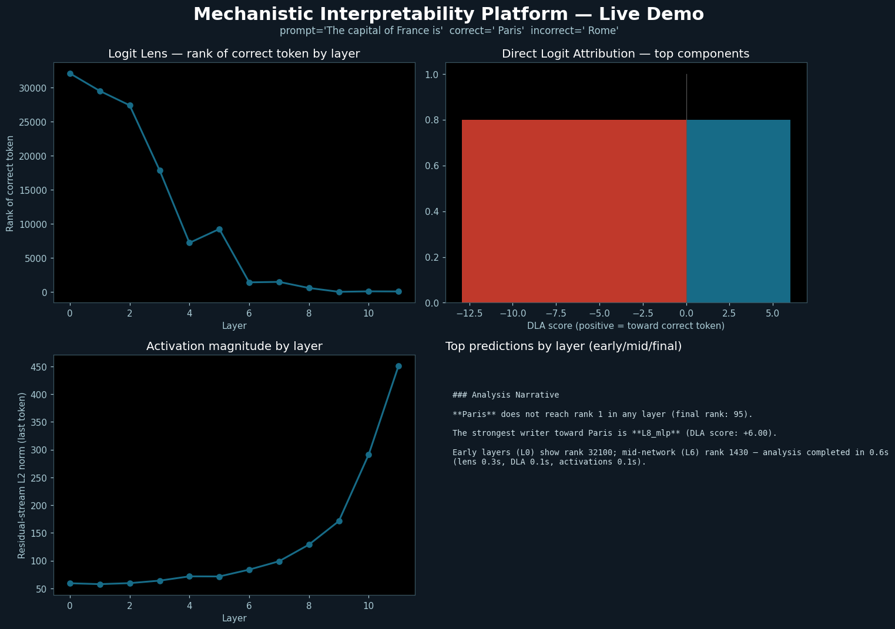

# Mechanistic Interpretability Platform

[](LICENSE)
[](https://github.com/ashlrai/mechanistic-interpretability/actions/workflows/ci.yml)
[](https://ashlrai.github.io/mechanistic-interpretability)
[](https://github.com/ashlrai/mechanistic-interpretability/actions)
[](https://mypy-lang.org/)
[](https://docs.astral.sh/ruff/)
[](CITATION.cff)
[](pyproject.toml)

Local mechanistic interpretability research at the speed of curiosity — 15 experiment families, closed-loop agentic followup, and a reproducibility receipt on every run.

Reproduce canonical circuits, audit refusal on any instruct model, train SAEs, and run multi-model sweeps — all on a MacBook Pro, with SQLite-backed run history and a 19-second quickstart.

---

## In 19 seconds

```bash
uv sync --group dev --extra interp
mech demo
```

```
mech demo — running 3 experiments on gpt2-small …
Experiments complete in 19.2s

╭──────────────────── mech demo — gpt2-small factual recall ────────────────────╮
│  Experiment               Finding                                    Value     │
│  Direct Logit Attribution Top writing component: L0_mlp            +2.841     │
│  Logit Lens               rank drops over 12 layers (never top-5)  rank 37    │
│  Circuit Patching         Top causal site: L8·resid_pre            93% recov. │
╰───────────────────────────────────────────────────────────────────────────────╯
```

DLA decomposes every component's contribution in one forward pass. Logit Lens tracks
how the model's best guess evolves layer by layer. Circuit Patching causally verifies
the top DLA site. All results are deterministic (seed=42).

---

## Headline Findings

### SAE Features Are Not Reproducible Across Seeds

Training five identical SAEs on gpt2-small (128 features, k=8, same corpus) and
aligning them with the Hungarian algorithm reveals:

| Condition | Layer | Median cosine | Stable @ ≥ 0.9 |
|---|---|---|---|
| Full matrix | 0 | 0.095 | 0.16% (2/1280) |
| Live features only | 0 | **0.500** | 0.48% |
| Live features only | 6 | 0.323 | 0.00% |
| 512 features, live | 6 | 0.257 | 0.00% |

**No condition crosses the 0.9 "same feature" threshold.** Fixing dead-feature
inflation raises the layer-0 median to 0.50 — meaningful overlap, not reproducibility.
Mid-network representations (layer 6) are *less* stable despite being more structured.
Published feature descriptions describe one training run, not the model.

→ [`docs/investigations/sae_replication_crisis.md`](docs/investigations/sae_replication_crisis.md)

---

### The Qwen Abliteration Recipe Fails

Four-stage mechanistic audit of `Qwen2.5-1.5B-Instruct` refusal:

| Stage | Key number |
|---|---|
| Direction extraction quality (layer 10) | **4.105** — clean linear separation |
| CAA steering: best behavioral shift | +0.33 (1/3 prompts, only at coeff −3.0) |
| Circuit patching: top site recovery | 1.037 (`blocks.11.hook_resid_post`) |
| Attention heads at same layers | 0.02–0.13 (near zero) |
| Causal scrubbing faithfulness | **0.041** — hypothesis formally rejected |

Refusal is linearly separable in the residual stream at layers 10–12, but the
attention heads at those layers write almost none of it. The standard Arditi/RepE
abliteration recipe — find the direction, ablate the attention head weights that
write it — produces faithfulness 0.04 under formal scrubbing. The recipe's
mechanistic assumption does not transfer to this checkpoint.

→ [`docs/investigations/refusal_audit.md`](docs/investigations/refusal_audit.md)

---

### GPT-2 Factual Recall Localized to a 4-Site Circuit

Six experiment families chained on gpt2-small factual recall:

| Evidence | Finding |
|---|---|
| Logit Lens | Correct token rank: 375 at L8 → **12.8 at L9** (phase transition) |
| DLA | L9.MLP writes **+9.29**; L8.MLP suppresses −3.15 |
| Attribution patching | `blocks.11.hook_resid_pre` top site, |score| 5.04 |
| Circuit patching | Recovery fraction = 1.0 at resid_pre L8–L11 |
| SAE at L9 | Geographic cluster: features 194, 212, 43 activate > 1080 on Paris docs |
| Causal scrubbing | 4-site circuit faithfulness **0.720** |

The 4-site hypothesis (L8.mlp_out + L9.resid_pre + L9.attn.z + L10.resid_pre)
captures 72% of model behavior. The residual 28% lives in earlier attention heads
(L5–L7) not yet patched.

→ [`docs/investigations/gpt2_factual_recall.md`](docs/investigations/gpt2_factual_recall.md)

---

## What You Can Do Today

| Task | Command |
|---|---|
| Reproduce IOI name-mover heads (Wang et al. 2022) | `mech run --name acdc-edge-ioi-gpt2-small` |
| Audit refusal on any instruct model | `mech audit-refusal` |
| Browse pretrained SAEs | `mech list-saes` → `mech download-sae` → `mech analyze-sae` |
| Apply steering vectors side-by-side | `mech apply-steering --vector <name>` |
| Train your own SAE | `mech run --name polysemanticity-sae-smoke` |
| Use any HuggingFace model | `backend: huggingface` in experiment YAML |
| Multi-model sweep | `mech sweep --axis "parameters.model=..."` |
| Interactive 4-panel UI | `mech gradio` |
| Closed-loop agentic research | `mech iterate-from-run --family polysemanticity_sae --artifact-dir <run> --max-depth 2` |

Discover all 37 commands: `mech help`

---

## Screenshots

<!-- TODO: capture Gradio demo screenshot:
     mech gradio --port 7860 &
     open http://localhost:7860
     # type prompt, run analysis, screenshot the 4-panel layout
     # save to docs/images/gradio_demo.png (1280x720) -->



<!-- TODO: capture Cockpit dashboard:
     mech cockpit
     open http://localhost:8000
     # navigate to a completed SAE or circuit run
     # save to docs/images/cockpit.png (1280x720) -->

---

## Install

```bash
# Base dev environment
uv sync --group dev

# Add TransformerLens + SAE backends
uv sync --group dev --extra interp

# Apple Silicon MLX support
uv sync --group dev --extra interp --extra apple

cp .env.example .env   # optional shell-level defaults
```

Run the local check gate:

```bash
bash scripts/check.sh
```

Full walkthrough: [`notebooks/05_research_walkthrough.ipynb`](notebooks/05_research_walkthrough.ipynb)

---

## Architecture

Two model access tiers:

1. **Instrumented backends** — TransformerLens (first-class), nnsight, MLX-native.
   Expose activations, hooks, and interventions required for mech-interp.
2. **Generation providers** — Ollama (`http://localhost:11434`), LM Studio
   (`http://localhost:1234/v1`). OpenAI-compatible black-box generation for
   baselines and dataset construction only.

Core packages:

| Package | Role |
|---|---|
| `mech_interp.backends` | Instrumented model adapters |
| `mech_interp.experiments` | Spec registry, 15 experiment families |
| `mech_interp.storage` | SQLite run metadata + artifact locations |
| `mech_interp.orchestration` | Local batch planning, resource policy |
| `mech_interp.datasets` | Prompt loaders, reproducibility hashes |
| `mech_interp.providers` | Black-box generation adapters |
| `mech_interp.config` | YAML configuration loading |

```text
YAML spec → registry → runner → seed + env fingerprint → family → SQLite + artifacts
```

Environment fingerprints (`torch` version, `uv.lock` SHA, seed, model name) are
written before execution — every result carries a reproducibility receipt.

```text
.
├── configs/          # Backend/model/experiment settings
├── experiments/      # Runnable experiment spec files
├── artifacts/        # Run metadata, tensors, reports, logs
├── data/             # Prompt corpora and datasets
├── notebooks/        # Exploratory analysis
├── scripts/          # check.sh, smoke.sh, helpers
└── src/mech_interp/  # Python package
```

---

## Acknowledgments and Citation

This platform implements and extends:

- Wang et al. (2022) — [Interpretability in the Wild: IOI](https://arxiv.org/abs/2211.00593) · `acdc_edge`, `acdc_lite`
- Bricken et al. (2023) — [Towards Monosemanticity](https://transformer-circuits.pub/2023/monosemanticity/) · `polysemanticity_sae`
- Conmy et al. (2023) — [Automated Circuit Discovery](https://arxiv.org/abs/2304.14997) · `acdc_lite`, `acdc_edge`
- Arditi et al. (2024) — [Refusal in LLMs](https://arxiv.org/abs/2406.11717) · `refusal_direction`, `mech audit-refusal`
- Gao et al. (2024) — [Scaling and Evaluating SAEs](https://arxiv.org/abs/2408.05147) · Top-K SAE implementation

To cite this platform, see [`CITATION.cff`](CITATION.cff).
